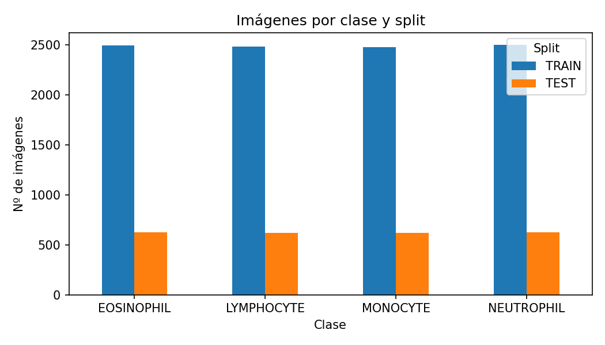
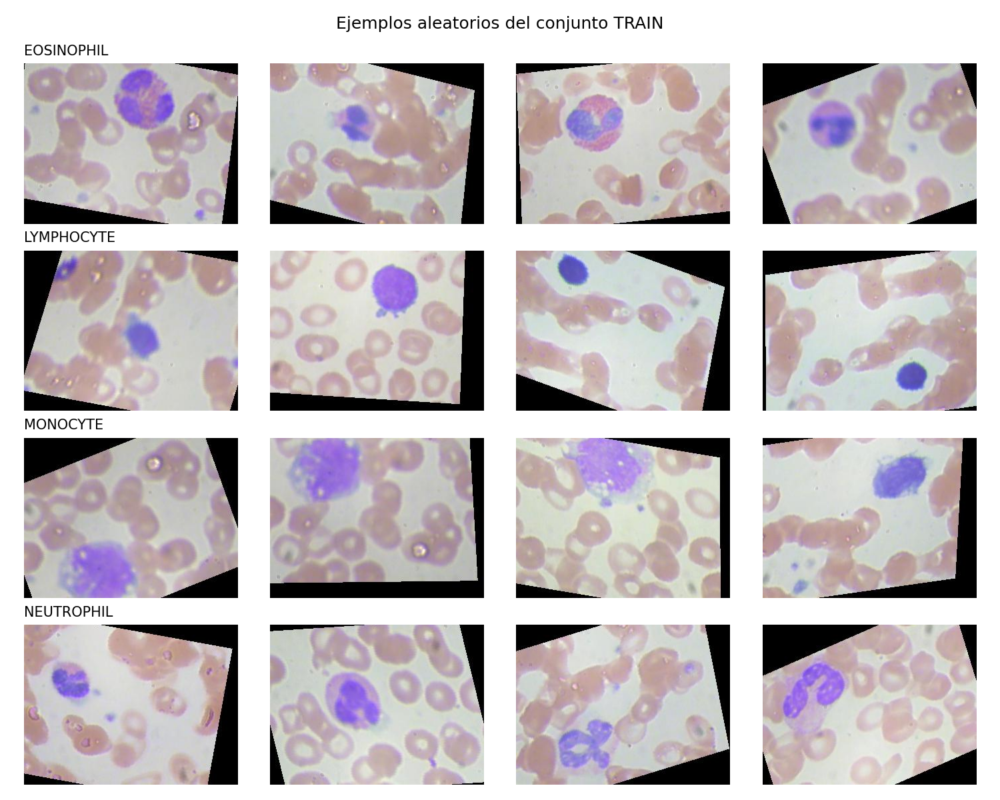
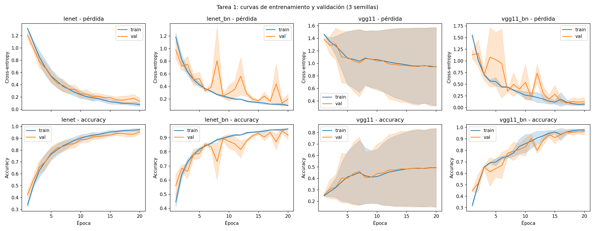
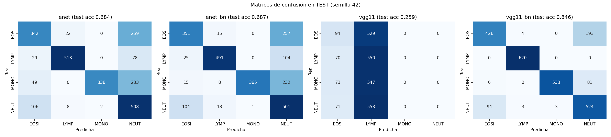
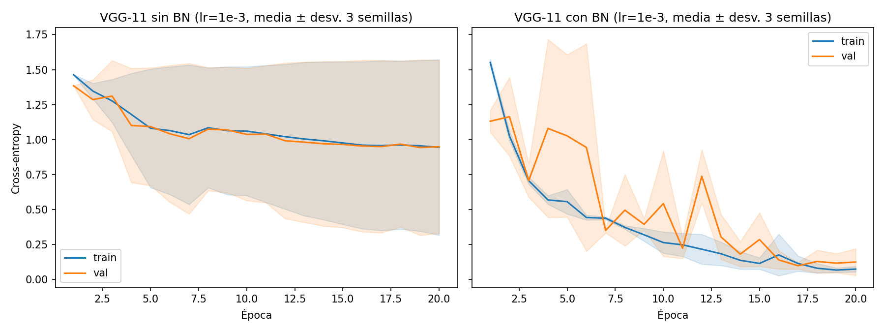
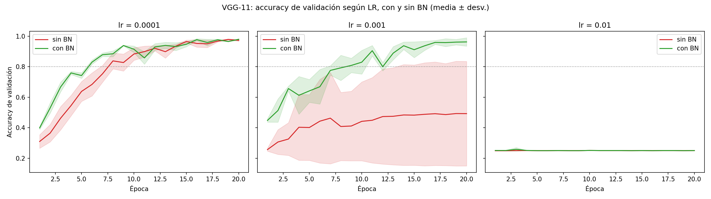
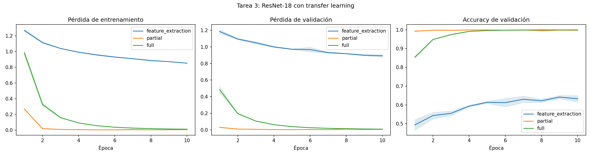
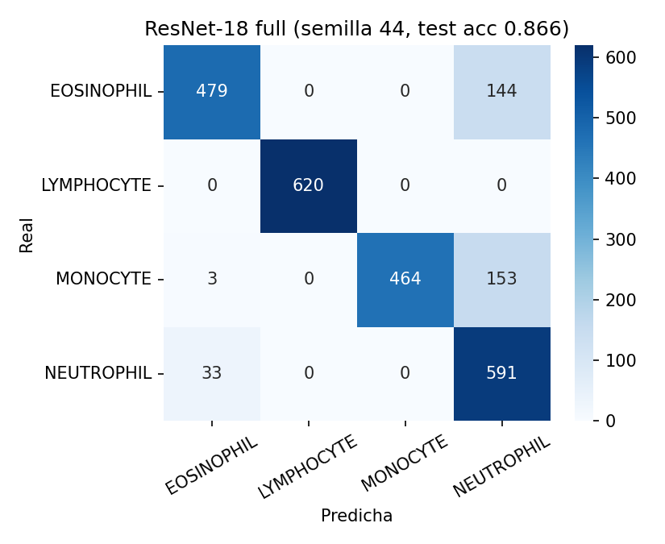

# Informe TP Semana 6 — Borrador de datos (para pasar a LaTeX)

## 1. Configuración

- Dataset: Blood Cells, 4 clases. TRAIN 9957 / TEST 2487. Validación: 15 % de TRAIN, estratificado (8463 train / 1494 val).
- Entrada 64×64, normalización media `(0.6791, 0.6418, 0.6610)`, std `(0.2587, 0.2580, 0.2556)`. Augmentation: flips horizontal y vertical.
- Adam, batch 64, 20 épocas, semillas 42/43/44, cuDNN determinista. GPU: RTX 4050 Laptop (6 GB), PyTorch 2.6.0+cu124.
- Test se evalúa con el checkpoint de mejor accuracy de validación.

## 2. Tarea 1 — LeNet-5 y VGG-11 (LR 1e-3, media ± desv., 3 semillas)

| Modelo | Parámetros | Tiempo/época (s) | Mejor val acc | Test acc | Épocas a 80 % val |
|---|---|---|---|---|---|
| LeNet-5 | 337 976 | 1.11 ± 0.39 | 0.9547 ± 0.0203 | 0.6570 ± 0.0663 | 6.3 ± 1.2 |
| LeNet-5 + BN | 337 998 | 1.43 ± 0.21 | 0.9525 ± 0.0093 | 0.6223 ± 0.0793 | 5.0 ± 0.8 |
| VGG-11 | 3 095 748 | 3.27 ± 0.03 | 0.5009 ± 0.3378 | 0.4725 ± 0.2892 | no llega (2/3 semillas) |
| VGG-11 + BN | 3 097 124 | 3.81 ± 0.07 | 0.9819 ± 0.0038 | 0.8514 ± 0.0164 | 9.0 ± 1.6 |

Por semilla (test acc): LeNet 0.684 / 0.566 / 0.721; LeNet+BN 0.687 / 0.670 / 0.511; VGG-11 0.259 / 0.277 / 0.881; VGG-11+BN 0.846 / 0.835 / 0.874.

Acierto por clase en test (semilla 42):

| Clase | LeNet | LeNet+BN | VGG-11 | VGG-11+BN |
|---|---|---|---|---|
| EOSINOPHIL | 0.549 | 0.563 | 0.151 | 0.684 |
| LYMPHOCYTE | 0.827 | 0.792 | 0.887 | 1.000 |
| MONOCYTE | 0.545 | 0.589 | 0.000 | 0.860 |
| NEUTROPHIL | 0.814 | 0.803 | 0.000 | 0.840 |

Observaciones:
- VGG-11 sin BN no entrena en 2 de 3 semillas (accuracy ≈ azar, 0.25).
- Brecha val → test grande (val 95–99 %, test 47–85 %); no verificada la causa.
- Mejor modelo desde cero: VGG-11 + BN (test 0.851 ± 0.016).

## 3. Tarea 2 — Efecto de Batch Normalization (VGG-11, 3 semillas)

| LR | BN | Semillas que llegan a 80 % | Épocas a 80 % (media) | Mejor val acc | Test acc |
|---|---|---|---|---|---|
| 1e-4 | sin BN | 3/3 | 8.3 | 0.979 ± 0.004 | 0.774 ± 0.025 |
| 1e-4 | con BN | 3/3 | 6.0 | 0.984 ± 0.001 | 0.783 ± 0.023 |
| 1e-3 | sin BN | 1/3 | 6.0 | 0.501 ± 0.338 | 0.472 ± 0.289 |
| 1e-3 | con BN | 3/3 | 9.0 | 0.982 ± 0.004 | 0.851 ± 0.016 |
| 1e-2 | sin BN | 0/3 | - | 0.251 ± 0.000 | 0.251 ± 0.000 |
| 1e-2 | con BN | 0/3 | - | 0.259 ± 0.011 | 0.259 ± 0.011 |

Observaciones:
- lr 1e-4: BN llega antes al 80 % (6.0 vs 8.3 épocas); accuracy final similar.
- lr 1e-3: BN entrena en 3/3 semillas, sin BN en 1/3.
- lr 1e-2: ninguna variante entrena (≈ azar); en este montaje BN no permitió un LR 10× mayor.
- Pendiente de discutir: Internal Covariate Shift (Ioffe & Szegedy, 2015).

## 4. Tarea 3 — Transfer learning (ResNet-18, ImageNet, 224×224, Adam, batch 64, 10 épocas, 3 semillas)

| Modelo | Parámetros totales | Entrenables | LR | Tiempo/época (s) | Mejor val acc | Test acc | Épocas a 80 % val |
|---|---|---|---|---|---|---|---|
| ResNet-18 feature extraction | 11 178 564 | 2 052 | 1e-3 | 17.2 ± 0.7 | 0.6466 ± 0.0085 | 0.4222 ± 0.0138 | no llega |
| ResNet-18 fine-tuning parcial | 11 178 564 | 10 495 492 | 1e-4 | 25.3 ± 0.8 | 0.9998 ± 0.0003 | 0.8250 ± 0.0082 | 1.0 (3/3) |
| ResNet-18 fine-tuning total | 11 178 564 | 11 178 564 | 1e-5 | 37.8 ± 0.4 | 1.0000 ± 0.0000 | 0.8603 ± 0.0042 | 1.0 (3/3) |
| VGG-11+BN desde cero (T1) | 3 097 124 | 3 097 124 | 1e-3 | 3.8 ± 0.1 | 0.9819 ± 0.0038 | 0.8514 ± 0.0164 | 9.0 (3/3) |

Test acc por semilla (42 / 43 / 44): feature extraction 0.403 / 0.429 / 0.434; parcial 0.832 / 0.830 / 0.813; total 0.856 / 0.859 / 0.866.

Acierto por clase, mejor modelo (fine-tuning total, semilla 44): EOSINOPHIL 0.769, LYMPHOCYTE 1.000, MONOCYTE 0.748, NEUTROPHIL 0.947.

Observaciones:
- Fine-tuning total es el mejor (test 0.860 ± 0.004) y el más estable entre semillas; supera por poco a VGG-11+BN desde cero (0.851 ± 0.016), dentro de una desviación de este último.
- Ambos fine-tuning llegan al 80 % de validación en la primera época; desde cero se necesitan 9.
- Feature extraction queda muy por debajo (test 0.42, val 0.65) con 10 épocas y solo la capa `fc` entrenable.
- Validación ≈ 100 % frente a test ≈ 83–86 %: la brecha persiste también con modelos preentrenados.
- Costo: fine-tuning total ≈ 10× más tiempo por época que VGG-11+BN desde cero.

## 5. Referencias

LeCun et al. (1998); Krizhevsky et al. (2012); Simonyan & Zisserman (2014); He et al. (2016); Ioffe & Szegedy (2015).
